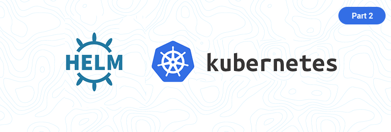

> A shell based project for grabbing helm artifacts and packaging them up into a single artifact to be ported to your offline on prem location. This will also generate the full list of containers needed to run every single helm package in your on prem.

[](https://github.com/cez-aug/github-project-boilerplate) [](https://creativecommons.org/publicdomain/zero/1.0/)

<br>

# Offline-Helm-Project
Perfect for pulling together all the Dependencies needed to port to an offline env
This is and always will be a Free and Open Source Project

## Containerized Helm Charts
We currently package the following helm charts into a container for transport to an offline environment
* Helm Charts Stable (to be depreicated)
* Helm Charts Incubator (to be depricated)
* Bitnami Charts
* Rancher Stable Charts
* Rancher Latest Charts
* Vm-Ware Charts
* Rook-Operator Charts

1) Run the container
```
docker run --name helm-packages -it docker.io/slvs/helm-packages sh
```
2) Then from a sperate terminal
```
docker cp helm-package:/helm-charts.tar .
```
3) Clean up
```
docker rm --force helm-package
```

With more to come! As Helm Hub replaces Helm Charts and projects host their own repos we will be replacing the charts found in Helm Stable with those 

## Running with Docker
### Pre Reqs
* docker

### How to run
You can run this all in an already created docker container by running the following command
```
docker run --name offline-helm-project -e KUBE_LATEST_VERSION="v1.18.3" -e HELM_VERSION="v3.2.4" -e MC_ALIAS="minio" -e MC_ENDPOINT="<Your_Misio_URL>" -e MC_ACCESS_KEY="<Your_Minio_KEY>" -e MC_SECRET_KEY="<Your_Minio_Password>" slvs/offline-helm-project:0.1.1
```

### Clean Up
```
docker rm offline-helm-project
```

## Running Local
### Pre Reqs
* git
* helm
* awscli
* mc (Minio client)

### How to install Minio client
```
wget https://dl.minio.io/client/mc/release/linux-amd64/mc
chmod +x mc
```

### How to install helm 3 on your machine
```
#helm is not included in this git project
sudo cp tools/helm /usr/bin/
```

### Script Usage
First get your helm Charts and List of Associated Docker Containers and the Pictures associated with the charts using this script
```
./all_gather_plus_pics.sh
```

